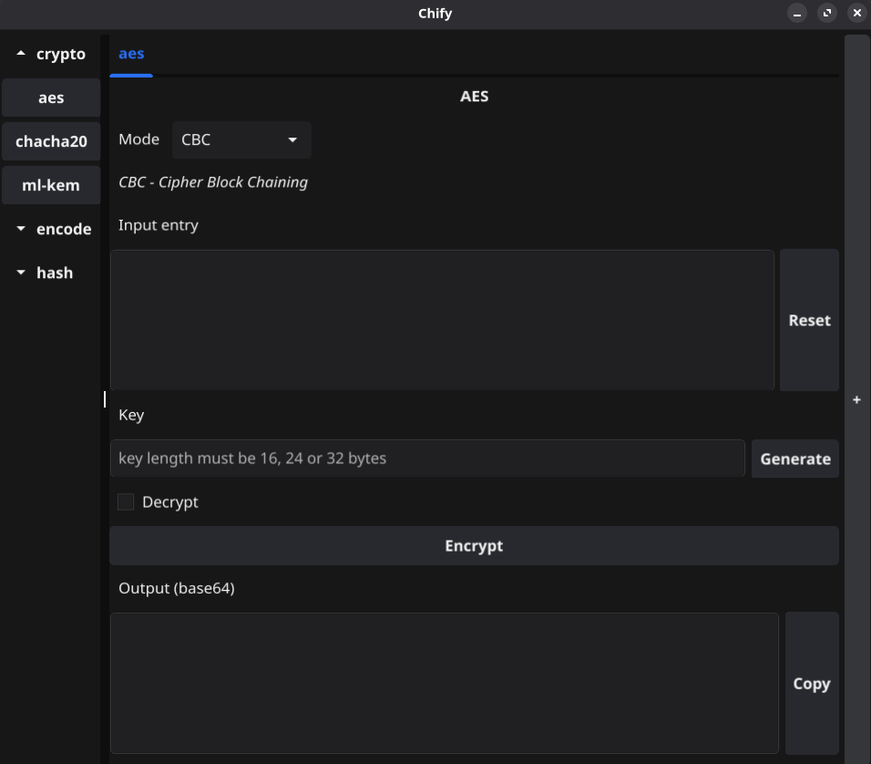

# Chify


[Русский](doc/README.ru.md)

Chify is a desktop application built with Go and Fyne that provides various cryptographic and encoding tools through a user-friendly interface.

## Features

- **Encryption/Decryption**
    - AES (CBC, GCM, CTR)
    - ChaCha20
    - ML-KEM (Kyber)
- **Encoding/Decoding**
    - base32, base64
    - ascii85
    - hex
- **Hashing**
    - SHA-1, SHA-224, SHA-256 
    - SHA3-224, SHA3-256, SHA3-384, SHA3-512 
    - SHA512-224, SHA512-256, SHA-384, SHA-512
    - MD5

- Multiple tabs support for working with different operations simultaneously
- Category-based sidebar for easy navigation between tools
- Clean and intuitive user interface

## Screenshots



## Getting Started

### Installation

Download release [here](https://github.com/pararti/chify/releases)

### Installation from source

1. Clone the repository
```bash
git clone https://github.com/yourusername/chify.git
cd chify
go mod tidy
```

2. Build the application
```bash
go build -o chify
```

3. Run the application
```bash
./chify
```

## Contributing

Contributions are welcome! Please feel free to submit a Pull Request.