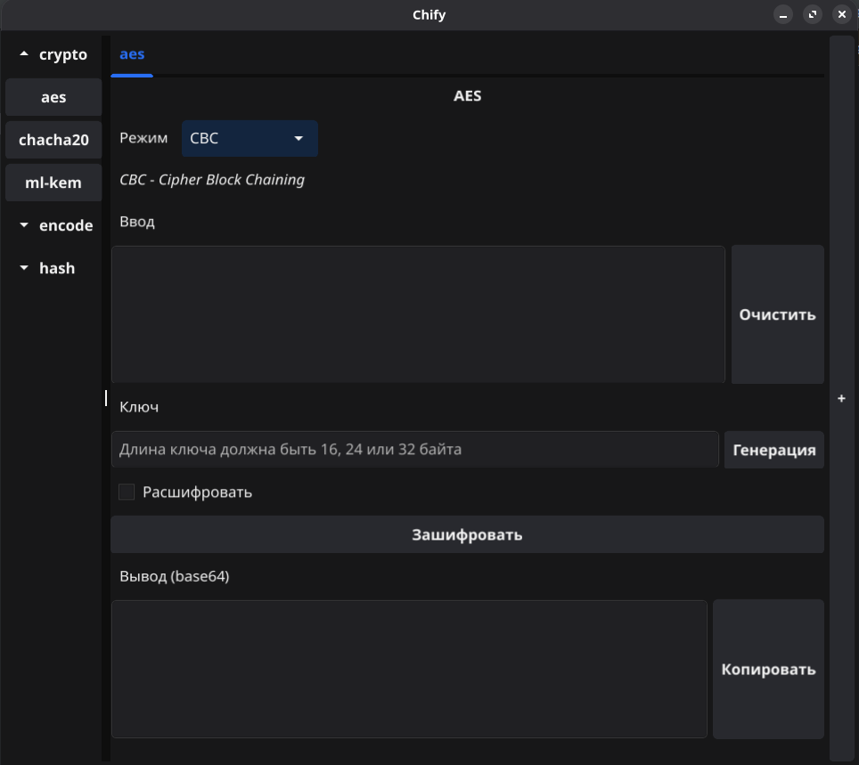

# Chify


Chify — это настольное приложение, разработанное на Go и Fyne, которое предоставляет различные криптографические и кодирующие инструменты через удобный пользовательский интерфейс.

## Возможности

- **Шифрование/Дешифрование**
    - AES (CBC, GCM, CTR)
    - ChaCha20
    - ML-KEM (Kyber)
- **Кодирование/Декодирование**
    - base32, base64
    - ascii85
    - hex
- **Хеширование**
    - SHA-1, SHA-224, SHA-256 
    - SHA3-224, SHA3-256, SHA3-384, SHA3-512 
    - SHA512-224, SHA512-256, SHA-384, SHA-512
    - MD5

- Поддержка нескольких вкладок для одновременной работы с разными операциями
- Боковая панель с категориями для удобной навигации между инструментами
- Чистый и интуитивно понятный пользовательский интерфейс

## Скриншоты




## Начало работы

### Установка

Скачайте релиз [здесь](https://github.com/pararti/chify/releases)

### Установка из исходного кода

1. Клонируйте репозиторий
```bash
git clone https://github.com/yourusername/chify.git
cd chify
go mod tidy
```

2. Соберите приложение
```bash
go build -o chify
```

3. Запустите приложение
```bash
./chify
```

## Вклад в проект

Мы приветствуем вклад в развитие проекта! Пожалуйста, не стесняйтесь создавать Pull Request.
